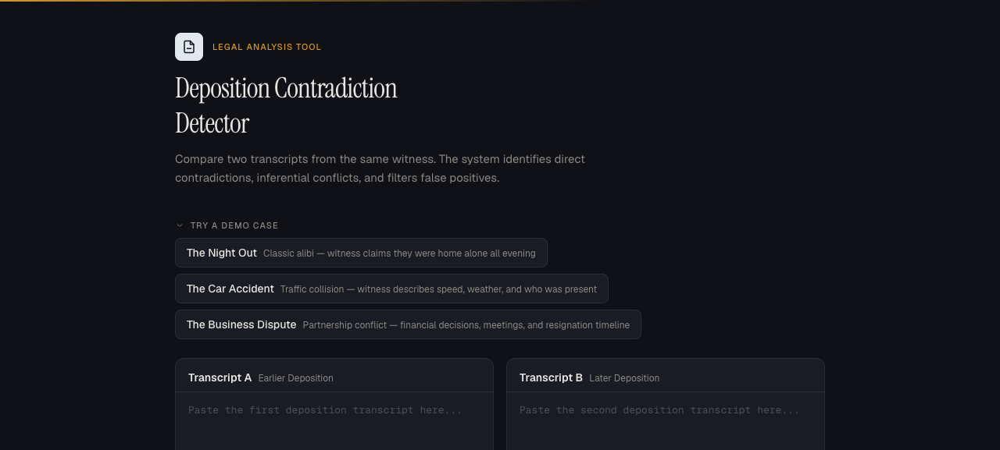

# Deposition Contradiction Detector

[](https://deposition-detector.vercel.app)
[](https://vercel.com)

A web application that uses AI to compare two deposition transcripts from the same witness and automatically identify contradictions — ranked by confidence with noise filtering.

Built for legal professionals who need to quickly surface inconsistencies across multiple witness depositions.

### 🔗 [Try it live → deposition-detector.vercel.app](https://deposition-detector.vercel.app)




## Features

- **AI-powered analysis** — Multi-provider support (Gemini 2.5 Flash primary, Groq fallback) for reliable analysis
- **Deterministic confidence scoring** — weighted algorithm combining contradiction type, metadata flags, and lexical overlap
- **Smart deduplication** — automatically merges near-identical contradictions to reduce noise
- **Noise filtering** — toggle to hide false positives and focus on real contradictions
- **Response caching** — identical analyses return instantly from cache
- **Sample cases** — three built-in demo scenarios (alibi, car accident, business dispute)
- **Export results** — copy analysis to clipboard in a structured format
- **Keyboard shortcuts** — `⌘+Enter` / `Ctrl+Enter` to analyze
- **Accessible UI** — ARIA labels, skip links, screen reader announcements
- **Input validation** — warnings for identical transcripts, missing Q&A format, and low overlap

## How It Works

```
┌─────────────────┐     ┌──────────────────┐     ┌─────────────────┐
│  Transcript A   │     │   Gemini AI      │     │   Deterministic │
│  Transcript B   │────▶│   (LLM Analysis) │────▶│   Scoring       │
└─────────────────┘     └──────────────────┘     └─────────────────┘
                                │                         │
                                ▼                         ▼
                    Identifies contradictions    Type weight (40%)
                    with categories:             Metadata weight (40%)
                    • DIRECT                     Lexical weight (20%)
                    • INFERENTIAL
                    • FALSE_POSITIVE
```

### Contradiction Categories

| Category | Description | Base Weight |
|----------|-------------|-------------|
| **Direct** | Witness explicitly states two mutually exclusive facts | 1.0 |
| **Inferential** | Both statements sound fine individually but cannot both be true | 0.65 |
| **False Positive** | Statements appear contradictory but are actually consistent | 0.15 |

### Confidence Scoring

Each contradiction receives a deterministic confidence score (0–100%) computed from three weighted components:

```
Score = (Type × 0.4) + (Metadata × 0.4) + (Lexical × 0.2)
```

- **Type weight (40%)** — Category severity: direct contradictions score higher than inferential
- **Metadata weight (40%)** — Binary conflict flags (time, location, identity) + semantic distance (1–5 scale)
- **Lexical weight (20%)** — Jaccard similarity between the two quotes (word overlap)

Same inputs always produce the exact same score — no randomness.

### Deduplication

After scoring, near-identical contradictions are automatically merged. Two contradictions are considered duplicates when **both** their `quote_a` and `quote_b` have Jaccard similarity > 0.7. When duplicates are detected, only the higher-confidence result is kept.

## Tech Stack

- **Framework**: Next.js 16 (App Router)
- **UI**: React 19, Tailwind CSS v4
- **AI**: Google Generative AI SDK (Gemini 2.5 Flash) + Groq (Llama 3.3 70B fallback)
- **Language**: TypeScript
- **Deployment**: Vercel

## Limits

- **Combined transcript length**: 50,000 characters maximum (both transcripts combined)
- This ensures reliable LLM processing and prevents context overflow

## Getting Started

### Prerequisites

- Node.js 18+
- A Google AI API key ([get one here](https://aistudio.google.com/apikey))

### Installation

```bash
# Clone the repository
git clone https://github.com/AKaLee-IK27/deposition-detector.git
cd deposition-detector

# Install dependencies
npm install

# Create environment file
echo 'GOOGLE_AI_API_KEY=your_key_here' > .env.local

# Start the development server
npm run dev
```

Open [http://localhost:3000](http://localhost:3000) in your browser.

### Environment Variables

| Variable | Required | Description |
|----------|----------|-------------|
| `GOOGLE_AI_API_KEY` | Yes | Google AI Studio API key for Gemini access |
| `GROQ_API_KEY` | No | Groq API key for Llama fallback (used if Gemini is unavailable) |

## Deployment

### Deploy to Vercel

The easiest way to deploy is with the [Vercel CLI](https://vercel.com/docs/cli):

```bash
# Install Vercel CLI
npm i -g vercel

# Deploy
vercel --prod
```

Or connect your GitHub repository at [vercel.com/new](https://vercel.com/new) for automatic deployments on push.

**Important**: After deployment, add `GOOGLE_AI_API_KEY` in your Vercel project's environment variables (Settings → Environment Variables).

## Project Structure

```
deposition-detector/
├── app/
│   ├── api/
│   │   └── analyze/
│   │       └── route.ts          # API endpoint: analysis + scoring + caching
│   ├── layout.tsx                # Root layout with fonts
│   ├── page.tsx                  # Main UI: input, results, sample cases
│   └── globals.css               # Design tokens and animations
├── components/
│   ├── ContradictionCard.tsx     # Individual contradiction display
│   ├── FilterBar.tsx             # Sort + noise filter controls
│   ├── ProcessingSteps.tsx       # Animated progress indicator
│   ├── Tooltip.tsx               # Accessible tooltip component
│   ├── TranscriptInput.tsx       # Text input with label
│   └── WarningBanner.tsx         # Input validation warnings
├── lib/
│   ├── cache.ts                  # In-memory response cache
│   ├── llm.ts                    # Multi-provider LLM client (Gemini + Groq)
│   ├── prompt.ts                 # System prompt for analysis
│   └── scorer.ts                 # Deterministic confidence scoring + deduplication
├── types/
│   └── contradiction.ts          # TypeScript types
└── public/                       # Static assets
```

## API

### `POST /api/analyze`

Compares two transcripts and returns scored contradictions.

**Request:**

```json
{
  "transcriptA": "Q: Where were you?\nA: I was home all night.",
  "transcriptB": "Q: Where were you?\nA: I stepped out around 7pm."
}
```

**Response:**

```json
{
  "contradictions": [
    {
      "quote_a": "I was home all night.",
      "quote_b": "I stepped out around 7pm.",
      "category": "DIRECT",
      "explanation": "Witness claims to have been home all night but also states they stepped out.",
      "has_time_conflict": true,
      "has_location_conflict": true,
      "has_identity_conflict": false,
      "semantic_distance": 5,
      "confidence_score": 0.85,
      "type_weight": 1.0,
      "metadata_weight": 0.75,
      "lexical_weight": 0.33
    }
  ]
}
```

## Future Enhancements

**Manual Category Override** — Allow lawyers to reclassify contradictions (e.g., INFERENTIAL → FALSE_POSITIVE) after review. The system would re-score based on the new category, but maintain stable display order until the user explicitly re-sorts. This preserves the AI's initial judgment while giving legal professionals final authority over classification.

## License

MIT
